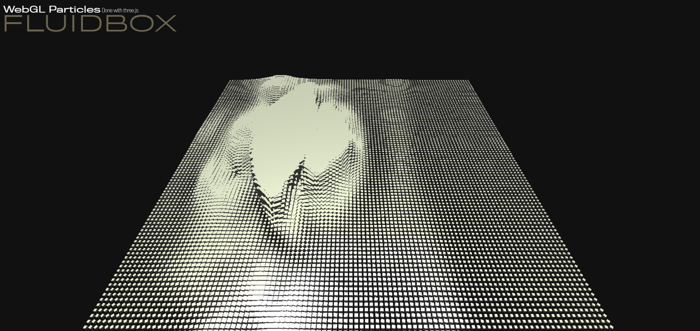

# Fluidbox

Three.js experiment with fluid particles using GPU rendering

## Description

This project show how to setup an advanced particle system using [three.js](https://threejs.org/).

It use advanced gpu render technics to increase framerate.

You can control the camera using mouse.

## Youtube video

Check the [video](https://youtu.be/qF6x2p_MqJc) on youtube.